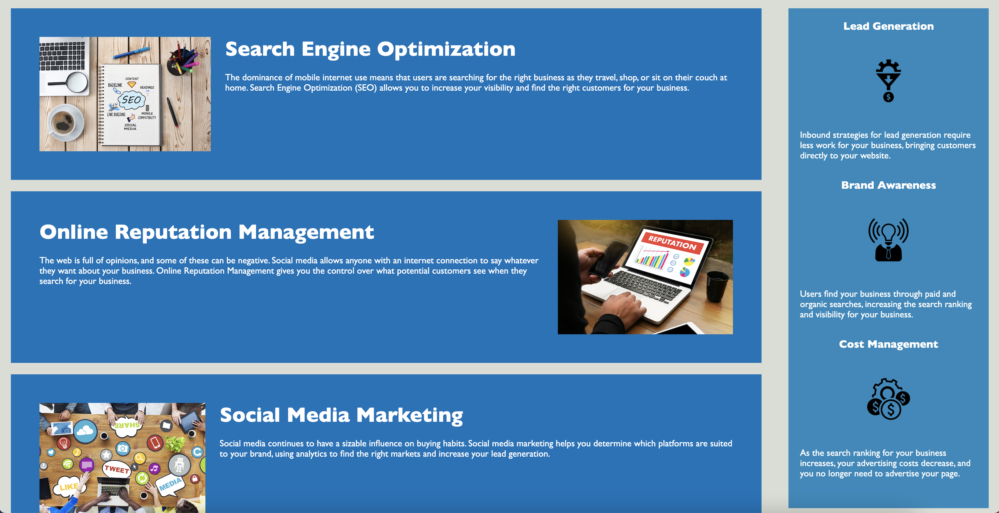

# Horiseon Landing Page

[Link to working page](https://devonfaria.github.io/fun-SEO-refactor/#search-engine-optimization)

## Table of Contents

* [Description](#description)
* [Visuals](#visuals)
* [Support](#Support)
* [Contributions](#contributions)

## Description

Welcome to the backend of the landing page I created for Horison Social Solutions! This project only uses one html and one css file, with a folder of images for your convenience. Use this page format for your own purposes!

## Visuals

The following layout is what you can expect to see on your browser.

## Support

Contact me at devonfaria@gmail.com if you need assistance downloading or activating this repository.

## Contributions

A huge thank you to the UNCC Virtual Bootcamp for providing me with the base code to make thie webpage stellar. Check them out on GitHub!